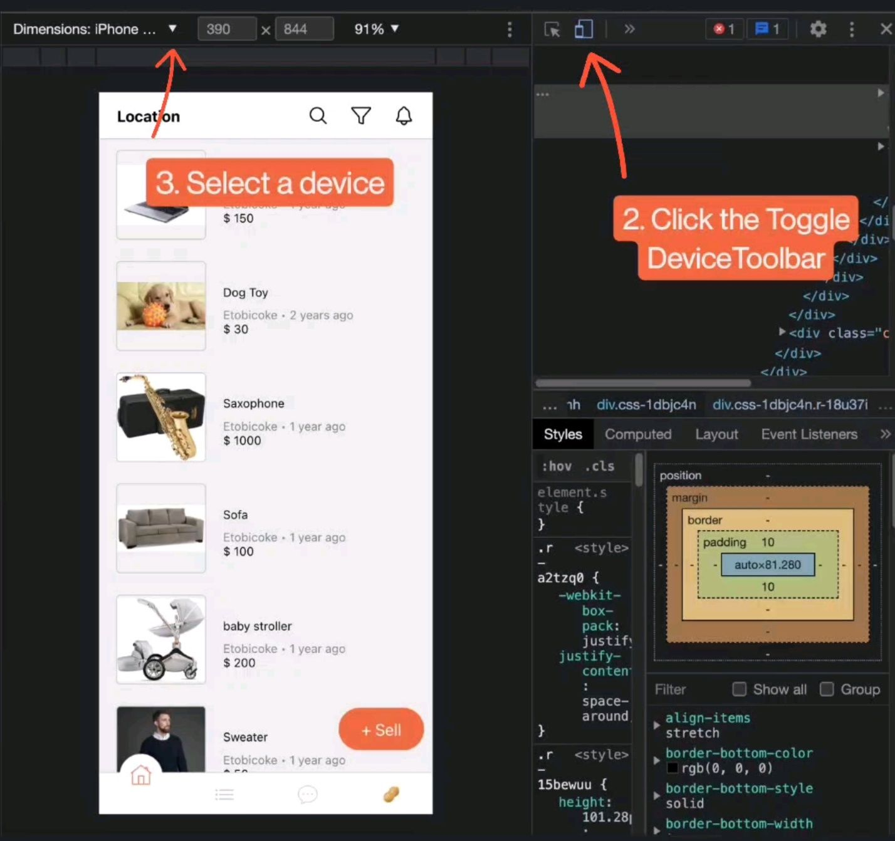

## A marketplace mobile app

The Marketplace is in development. More features are getting added.

The Marketplace is created using Expo. For an optimal experience, please download Expo first on your mobile device and then use Expo to open the app.

\*\*\*Once you are on a mobile device please click [here](https://expo.dev/@peanutz/karrot) to do the above.

Alternatively, you may view The Marketplace in your browser by clicking [here](https://peanutz-marketplace.herokuapp.com). However, some features and stylings are not web-compatible at the moment.

<!--  -->

### Context

This app is built using React Native and Redux. I intend to reverse engineer an app called [Karrot](https://uk.karrotmarket.com/)- a marketplace. Initially, my purpose was to demonstrate how the state is maintained using Redux. Therefore, Chat, share and some functionalities under 'My Account' are unavailable. However, the plan has changed, and I will go deeper and expand on this project. I want to challenge myself on a larger scale project.

### To navigate

Your username is Tony once you are on the app. The app includes:

-Home-

- Tap the orange sell button to post an item that you would like to sell
- Search items by text and filter results (e.g. dress or makeup)
- Search users by member ID (e.g. 222 or 333)
- Customize your feeds by category
- Scroll and view items posted by others
- Tap an item to view its details
- Favourite an item (see all favourite items under my account tab)
- Tap the seller's profile picture to view the seller's reviews and/or rate the seller
- Tap the three dots icon to block or hide the seller (all items or search results from this seller would not appear if they are blocked. Hidden items will appear in search results but not on your feeds)
- View the seller's other items

-Category-

- View all items for sale under a selected category

-My Account-

- Change your profile picture and name by tapping the camera icon
- Tap view profile for a list of your active, sold, hidden items and toggle their statuses

### To Be Added

- [ ] External Data storage

- [ ] Authentication - login

- [ ] Chat

### Road blocks

Resolved

- [x] Enable viewers to view the app on desktops besides their mobile devices. Doing so will add accessibility and convenience for viewers.
