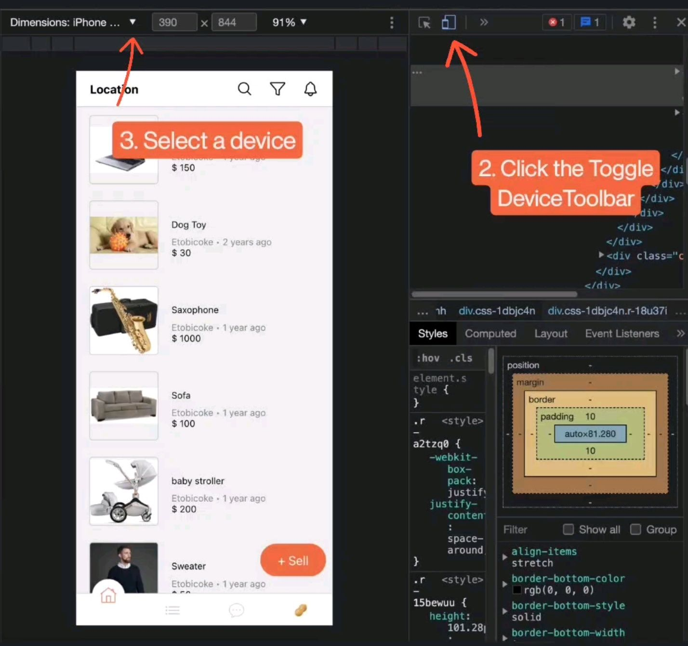

## Web/Mobile App - eMarketplace

[DEMO](https://drive.google.com/file/d/13r3OjZL79GkNJdT6bAutL0Z8CqEVVwmH/view?usp=sharing)

### View On A Mobile Device

- on a mobile device download Expo Go in the App/Play Store
- click on the version you would like to view below to reveal the QR code
- scan the code using Expo Go on your phone, and the app should open

There are two versions :

[Redux Version](https://expo.dev/@peanutz/karrot)
Hardcoded data and utilizes Redux to maintain state for exploring purposes. You can find the code under the “redux_version” branch.

[Full Stack Version](https://expo.dev/@/projects/marketplace)
Connected to the backend and database using RESTful APIs and MongoDB. Work in progress.

### View In The Browser

- right click on one of the link below and select "Open Link in New Tab"

[Redux Version](https://peanutz-emarketplace.herokuapp.com/)
[Full Stack Version](https://marketplace-ipcn.onrender.com/)

The app should open up in a new tab. Once loaded, do the following in the new tab:

- open Developer tools
- do the two steps below and refresh the page after the steps are completed

### To navigate

Your username is Tony once you are on the app. The app includes:

-Home-

- Tap the orange sell button to post an item that you would like to sell
- Search items by text and filter results (e.g. dress or makeup)
- Search users by member ID (e.g. 222 or 333)
- Customize your feeds by category
- Scroll and view items posted by others
- Tap an item to view its details
- Favourite an item (see all favourite items under my account tab)
- Tap the seller's profile picture to view the seller's reviews and/or rate the seller
- Tap the three dots icon to block or hide the seller (all items or search results from this seller would not appear if they are blocked. Hidden items will appear in search results but not on your feeds)
- View the seller's other items

-Category-

- View all items for sale under a selected category

-My Account-

- Change your profile picture and name by tapping the camera icon
- Tap view profile for a list of your active, sold, hidden items and toggle their statuses

### Tech-Stack

- JavaScript
- React Native
- RESTFUL APIs
- MongoDB
- Android Studio
- xCode
- Redux
- Expo

### Context

I intend to reverse engineer an app called [Karrot](https://uk.karrotmarket.com/)- a marketplace. Initially, my purpose was to demonstrate how the state is maintained using Redux. Therefore, Chat, share and some functionalities under 'My Account' are unavailable. However, the plan has changed, and I want to challenge myself on a larger scale project. Therefore, I am expand the project to a full stack application.

### Road blocks

Resolved

- [x] Fix style and feature incompatibilities across web, ios and android platforms after Expo version upgrade
- [x] Enable viewers to view the app on desktops besides their mobile devices. Doing so will add accessibility and convenience for viewers

### To Be Added

- [x] External Data storage

- [ ] Authentication - login

- [ ] Chat
